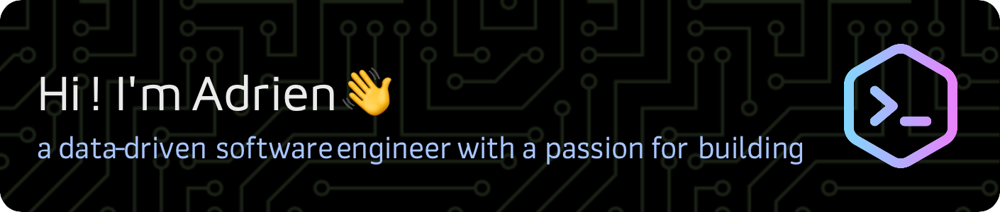

<!--
<h1 align="center">Hi! I'm Adrien 👋</h1>
<h3 align="center">a data-driven software engineer who's passionate about building</h3>
-->

Committed to generating <strong>impact</strong>, delighting <strong>users</strong>, leaning into <strong>cool ideas</strong>, and <strong>learning</strong> along the way :-)

<!--
<h3 align="left">Connect with me:</h3>
-->

  <a href="https://linkedin.com/in/adrienlynch" target="_blank">-LinkedIn-2874A6?style=for-the-badge&logo=data:image/svg+xml;base64,PD94bWwgdmVyc2lvbj0iMS4wIiBlbmNvZGluZz0iaXNvLTg4NTktMSI/Pg0KPCEtLSBHZW5lcmF0b3I6IEFkb2JlIElsbHVzdHJhdG9yIDE5LjAuMCwgU1ZHIEV4cG9ydCBQbHVnLUluIC4gU1ZHIFZlcnNpb246IDYuMDAgQnVpbGQgMCkgIC0tPg0KPHN2ZyB2ZXJzaW9uPSIxLjEiIGlkPSJDYXBhXzEiIHhtbG5zPSJodHRwOi8vd3d3LnczLm9yZy8yMDAwL3N2ZyIgeG1sbnM6eGxpbms9Imh0dHA6Ly93d3cudzMub3JnLzE5OTkveGxpbmsiIHg9IjBweCIgeT0iMHB4Ig0KCSB2aWV3Qm94PSIwIDAgNTEyIDUxMiIgc3R5bGU9ImVuYWJsZS1iYWNrZ3JvdW5kOm5ldyAwIDAgNTEyIDUxMjsiIHhtbDpzcGFjZT0icHJlc2VydmUiPg0KPGc+DQoJPHJlY3QgeT0iMTYwIiBzdHlsZT0iZmlsbDojMTk3NkQyOyIgd2lkdGg9IjExNC40OTYiIGhlaWdodD0iMzUyIi8+DQoJPHBhdGggc3R5bGU9ImZpbGw6IzE5NzZEMjsiIGQ9Ik00MjYuMzY4LDE2NC4xMjhjLTEuMjE2LTAuMzg0LTIuMzY4LTAuOC0zLjY0OC0xLjE1MmMtMS41MzYtMC4zNTItMy4wNzItMC42NC00LjY0LTAuODk2DQoJCWMtNi4wOC0xLjIxNi0xMi43MzYtMi4wOC0yMC41NDQtMi4wOGwwLDBsMCwwYy02Ni43NTIsMC0xMDkuMDg4LDQ4LjU0NC0xMjMuMDQsNjcuMjk2VjE2MEgxNjB2MzUyaDExNC40OTZWMzIwDQoJCWMwLDAsODYuNTI4LTEyMC41MTIsMTIzLjA0LTMyYzAsNzkuMDA4LDAsMjI0LDAsMjI0SDUxMlYyNzQuNDY0QzUxMiwyMjEuMjgsNDc1LjU1MiwxNzYuOTYsNDI2LjM2OCwxNjQuMTI4eiIvPg0KCTxjaXJjbGUgc3R5bGU9ImZpbGw6IzE5NzZEMjsiIGN4PSI1NiIgY3k9IjU2IiByPSI1NiIvPg0KPC9nPg0KPGc+DQo8L2c+DQo8Zz4NCjwvZz4NCjxnPg0KPC9nPg0KPGc+DQo8L2c+DQo8Zz4NCjwvZz4NCjxnPg0KPC9nPg0KPGc+DQo8L2c+DQo8Zz4NCjwvZz4NCjxnPg0KPC9nPg0KPGc+DQo8L2c+DQo8Zz4NCjwvZz4NCjxnPg0KPC9nPg0KPGc+DQo8L2c+DQo8Zz4NCjwvZz4NCjxnPg0KPC9nPg0KPC9zdmc+DQo=" style="vertical-align:center" /></a>
  &nbsp;&nbsp;&nbsp;
  <a href="https://www.hackerrank.com/adriien" target="_blank">-HackerRank-229954?style=for-the-badge&logo=data:image/svg+xml;base64,PHN2ZyB2ZXJzaW9uPScxLjEnIGlkPSdMYXllcl8xJyB4bWxucz0naHR0cDovL3d3dy53My5vcmcvMjAwMC9zdmcnIHhtbG5zOnhsaW5rPSdodHRwOi8vd3d3LnczLm9yZy8xOTk5L3hsaW5rJyB4PScwcHgnIHk9JzBweCcgdmlld0JveD0nMCAwIDI1NiAyNTYnIHN0eWxlPSdlbmFibGUtYmFja2dyb3VuZDpuZXcgMCAwIDI1NiAyNTY7JyB4bWw6c3BhY2U9J3ByZXNlcnZlJz48c3R5bGUgdHlwZT0ndGV4dC9jc3MnPiAuc3Qwe2ZpbGw6IzBFMTQxRTt9IC5zdDF7ZmlsbDojRkZGRkZGO30gLnN0MntmaWxsOiMwMEVBNjQ7fQo8L3N0eWxlPjxyZWN0IHg9JzAnIHk9JzAnIGNsYXNzPSdzdDAnIHdpZHRoPScyNTYnIGhlaWdodD0nMjU2Jy8+PGc+PHBhdGggY2xhc3M9J3N0MScgZD0nTTEyNS4zOSw4NS4zNWgtMTkuMjZjLTAuNjUsMC0xLjE4LDAuNTMtMS4xOCwxLjE4djMwLjYxSDg0LjJWODYuNTRjMC0wLjY1LTAuNTMtMS4xOC0xLjE4LTEuMThINjMuNzYgYy0wLjY1LDAtMS4xOCwwLjUzLTEuMTgsMS4xOHY4Mi44NWMwLDAuNjUsMC41MywxLjE4LDEuMTgsMS4xOGgxOS4yNmMwLjY1LDAsMS4xOC0wLjUzLDEuMTgtMS4xOHYtMzAuNjFoMjAuNzV2MzAuNjEgYzAsMC42NSwwLjUzLDEuMTgsMS4xOCwxLjE4aDE5LjI2YzAuNjUsMCwxLjE4LTAuNTMsMS4xOC0xLjE4Vjg2LjU0QzEyNi41Nyw4NS44OCwxMjYuMDQsODUuMzUsMTI1LjM5LDg1LjM1eicvPjxwYXRoIGNsYXNzPSdzdDInIGQ9J00xOTkuNzYsMTcwLjU3aC02MS42NGMtMC42NSwwLTEuMTgtMC41My0xLjE4LTEuMThWODYuNTNjMC0wLjY1LDAuNTMtMS4xOCwxLjE4LTEuMThoNjEuNjQgYzAuNjUsMCwxLjE4LDAuNTMsMS4xOCwxLjE4djgyLjg1QzIwMC45NCwxNzAuMDQsMjAwLjQxLDE3MC41NywxOTkuNzYsMTcwLjU3eicvPjwvZz48L3N2Zz4K" style="vertical-align:center" /></a>
  &nbsp;&nbsp;&nbsp;
  <a href="https://www.leetcode.com/adriienlynch" target="_blank">-LeetCode-EE9214?style=for-the-badge&logo=data:image/svg+xml;base64,PD94bWwgdmVyc2lvbj0iMS4wIiBlbmNvZGluZz0iVVRGLTgiPz4KPHN2ZyB3aWR0aD0iOTRweCIgaGVpZ2h0PSIxMTFweCIgdmlld0JveD0iMCAwIDk0IDExMSIgdmVyc2lvbj0iMS4xIiB4bWxucz0iaHR0cDovL3d3dy53My5vcmcvMjAwMC9zdmciIHhtbG5zOnhsaW5rPSJodHRwOi8vd3d3LnczLm9yZy8xOTk5L3hsaW5rIj4KICAgIDwhLS0gR2VuZXJhdG9yOiBTa2V0Y2ggNTIuNSAoNjc0NjkpIC0gaHR0cDovL3d3dy5ib2hlbWlhbmNvZGluZy5jb20vc2tldGNoIC0tPgogICAgPHRpdGxlPjFfYmxhY2s8L3RpdGxlPgogICAgPGRlc2M+Q3JlYXRlZCB3aXRoIFNrZXRjaC48L2Rlc2M+CiAgICA8ZyBpZD0iUGFnZS0xIiBzdHJva2U9Im5vbmUiIHN0cm9rZS13aWR0aD0iMSIgZmlsbD0ibm9uZSIgZmlsbC1ydWxlPSJldmVub2RkIj4KICAgICAgICA8ZyBpZD0iYnJhbmRpbmdfLXJlc291cmNlIiB0cmFuc2Zvcm09InRyYW5zbGF0ZSgtMjA5My4wMDAwMDAsIC0yOTAuMDAwMDAwKSI+CiAgICAgICAgICAgIDxnIGlkPSIxX2JsYWNrIiB0cmFuc2Zvcm09InRyYW5zbGF0ZSgyMDkzLjAwMDAwMCwgMjkwLjAwMDAwMCkiPgogICAgICAgICAgICAgICAgPHBhdGggZD0iTTY3LjUwNjgzMzksODMuMDY2NDEzOCBDNzAuMDAwNTM4NCw4MC41NzYzNzg2IDc0LjAzNzE0MDIsODAuNTgyODgyMiA3Ni41MjI4MzYyLDgzLjA4MDkzOTggQzc5LjAwODUzMjIsODUuNTc4OTk3NSA3OS4wMDIwNCw4OS42MjI2NDU2IDc2LjUwODMzNTUsOTIuMTEyNjgwOCBMNjUuNDM1MTQ1MSwxMDMuMTY5NTc3IEM1NS4yMTkyMzMyLDExMy4zNzA3NDQgMzguNTYwNDY2MywxMTMuNTE4NjczIDI4LjE3MjI1NzgsMTAzLjUxMzIwNCBDMjguMTEyMjE3LDEwMy40NTU2NzggMjMuNDg2NTgzLDk4LjkyMDEzMjYgOC4yMjcwMjU4NSw4My45NTcwMTk1IEMtMS45MjQ3ODQ3OSw3NC4wMDI4ODk1IC0yLjkzNjE0OTQ1LDU4LjA3NDg3MzYgNi42MTY5NzU0OSw0Ny44NDYzNjQ0IEwyNC40Mjg2OTQ0LDI4Ljc3NDU0NjEgQzMzLjkxMDAwNDMsMTguNjIxODU5NCA1MS4zODc0NDg3LDE3LjUxMjIyNDYgNjIuMjI3OTkwNywyNi4yNzg5MjMyIEw3OC40MDUyOTEyLDM5LjM2MjAyMzUgQzgxLjE0NDg5NTYsNDEuNTc3NjI5MiA4MS41NzI4MTAzLDQ1LjU5ODQ5NzUgNzkuMzYxMDY1NSw0OC4zNDI4ODQyIEM3Ny4xNDkzMjA3LDUxLjA4NzI3MDkgNzMuMTM1NDU5Miw1MS41MTU5MzI3IDcwLjM5NTg1NDgsNDkuMzAwMzI3IEw1NC4yMTg2NjM0LDM2LjIxNzMxNDkgQzQ4LjU0OTI4MTMsMzEuNjMyNTEwNSAzOC42MzE5MTEsMzIuMjYyMTU5NyAzMy43Mzk4NTM1LDM3LjUwMDYyNjUgTDE1LjkyNzkwNTYsNTYuNTcyNjg5OSBDMTEuMjc3MjA3Myw2MS41NTIxODIgMTEuNzg2NTYxMyw2OS41NzQwMTU2IDE3LjE0NjEyODMsNzQuODI5MjE4NiBDMjguMzUxNTMzOSw4NS44MTY5MzkzIDM2Ljk4NzQwNzEsOTQuMjg0NjIxNCAzNi45OTczOTg4LDk0LjI5NDIyNSBDNDIuMzk4MTU3MSw5OS40OTU5ODM4IDUxLjEzMDg2Miw5OS40MTg0MzggNTYuNDMzNTgsOTQuMTIzMzczNyBMNjcuNTA2ODMzOSw4My4wNjY0MTM4IFoiIGlkPSJwYXRoXzMiIGZpbGw9IiNGRkExMTYiIGZpbGwtcnVsZT0ibm9uemVybyI+PC9wYXRoPgogICAgICAgICAgICAgICAgPHBhdGggZD0iTTQwLjYwNjk5MTQsNzIuMDAxNDExNyBDMzcuMDg2MDE5LDcyLjAwMTQxMTcgMzQuMjMxNzA2OCw2OS4xNDIxMTcgMzQuMjMxNzA2OCw2NS42MTQ5OTgyIEMzNC4yMzE3MDY4LDYyLjA4Nzg3OTQgMzcuMDg2MDE5LDU5LjIyODU4NDcgNDAuNjA2OTkxNCw1OS4yMjg1ODQ3IEw4Ny42MjQ3MTU0LDU5LjIyODU4NDcgQzkxLjE0NTY4NzksNTkuMjI4NTg0NyA5NCw2Mi4wODc4Nzk0IDk0LDY1LjYxNDk5ODIgQzk0LDY5LjE0MjExNyA5MS4xNDU2ODc5LDcyLjAwMTQxMTcgODcuNjI0NzE1NCw3Mi4wMDE0MTE3IEw0MC42MDY5OTE0LDcyLjAwMTQxMTcgWiIgaWQ9InBhdGhfMiIgZmlsbD0iI0IzQjNCMyI+PC9wYXRoPgogICAgICAgICAgICAgICAgPHBhdGggZD0iTTQ5LjQxMjQzMTUsMi4wMjMzNTAwMiBDNTEuODE3ODk4MSwtMC41NTIzMjA0NTQgNTUuODUyMjY5LC0wLjY4Njg5Mzk0NSA1OC40MjM0NTExLDEuNzIyNzcxNzIgQzYwLjk5NDYzMzMsNC4xMzI0MzczOCA2MS4xMjg5NzIyLDguMTczODUwODMgNTguNzIzNTA1NiwxMC43NDk1MjEzIEwxNS45MjgyMjc3LDU2LjU3Mjg2OTcgQzExLjI3NzM2NTksNjEuNTUxOTg0IDExLjc4NjcxNjgsNjkuNTczNzY4OSAxNy4xNDU5MzA5LDc0LjgyOTE4MzIgTDM2LjkwOTQyMzYsOTQuMjA5MTA5OSBDMzkuNDI1NTUxNCw5Ni42NzY0MDUxIDM5LjQ2ODYyMzQsMTAwLjcxOTgyOCAzNy4wMDU2Mjc3LDEwMy4yNDAzNDggQzM0LjU0MjYzMTksMTA1Ljc2MDg2OCAzMC41MDYyNTQ4LDEwNS44MDQwMTYgMjcuOTkwMTI3LDEwMy4zMzY3MiBMOC4yMjY1NDI4OSw4My45NTY3MDQxIEMtMS45MjQ2NzQxNCw3NC4wMDIxMDA1IC0yLjkzNjAzNTI3LDU4LjA3NDE0MDIgNi42MTc1MTUzMyw0Ny44NDYzMTEgTDQ5LjQxMjQzMTUsMi4wMjMzNTAwMiBaIiBpZD0icGF0aF8xIiBmaWxsPSIjRkZGRkZGIj48L3BhdGg+CiAgICAgICAgICAgIDwvZz4KICAgICAgICA8L2c+CiAgICA8L2c+Cjwvc3ZnPgo=" style="vertical-align:center" /></a>

<!--

  

  

-->

#### Projects & Tech
- ✏️ I’m currently working on [whale-shark-site](https://github.com/aadriien/whale-shark-site) and [ESP32-lightsaber](https://github.com/aadriien/ESP32-lightsaber), while pairing on [penguin-puzzle](https://github.com/eayhkim/penguin-puzzle)

- 🎮 I'm also designing a series of [open source utilities](https://github.com/aadriien/pico8-devbuddy) to improve the PICO-8 dev experience 
  
- 🔭 Some recently-finished projects include...
  - my own [personal website](https://aadriien.github.io) with webring integration!
  - a retro-style [galactic game](https://github.com/aadriien/GMTK-starship-loopers) that invites players to loop through space ([GMTK 2025](https://microscientist.itch.io/starship-loopers) submission) 
  - a delightful [choose your adventure](https://github.com/aadriien/choose-your-llm-face-adventure) quest that blends generative AI (LLMs) and computer vision
  - a lively [browser game](https://github.com/aadriien/pose-pulse) that incorporates computer vision and augmented reality
  - a neat little ASCII [art tool](https://github.com/aadriien/generative-ascii-art) that leverages LLMs for some generative AI magic
  - a useful [price tracker](https://github.com/aadriien/price-tracker) that connects to Gmail (with OAuth 2.0) for purchase extraction

- 🌱 Right now, I'm learning **React** and **Svelte**, experimenting with **generative AI**, and diving into **computer vision**

- 🌀 You'll also find me toying with tools like **Three**.js, **P5**.js, **D3**.js, **ElevenLabs**, and even **KiCad** 

#### Reflective Recap
  
- 👨‍💻 Check out some of my past projects: [github.com/aadriien](https://github.com/aadriien?tab=repositories)

- ❤️ Check out some of my favorite tech communities: [hackNY](https://hackny.org) and [the Recurse Center](https://www.recurse.com)

- 📽️ See the [presentations and talks](https://aadriien.github.io) I've given on my technical work

#### Digging Deeper
- 💬 Ask me about my approach to **user-centric engineering**

- 📫 Reach out by sending me an [email](mailto:adriienlynch@gmail.com)

- 🌟 Fun fact: I have a knack for languages, speaking **Spanish** and **French** fluently (+ conversational **German**, see [Emil-Spiel](https://github.com/aadriien/Emil-Spiel))

<h3 align="left">Languages and Tools:</h3>

 
<!--     -->
<!--     -->
   
<!--     -->
   
   
<!--     --> 
<!--     -->
   
   
<!--     -->
   
    
   
<!--     -->
<!--     -->
   
   
   
   
   
   
   
<!--     -->
<!--     -->
   
   
<!--     -->

 

>-public: 23 || private: 29-9FE2BF" alt="Repo Count">

<!--

&nbsp;

-->

